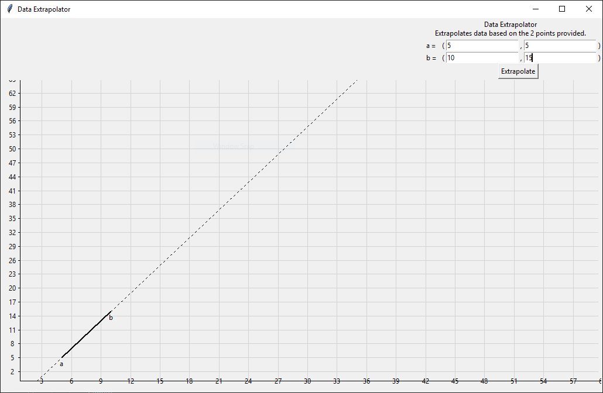

# Tkinter Extrapolate
Extrapolates data on a line graph based on 2 points.

Works best with smaller numbers and positive slopes, helpful for predicting data over time.

### Features
- Auto-rescales on window resize
- Graph auto-scales to fit your data
- Simple, intuitive interface



### Usage

Depends:
- python3
- tkinter


Unix-likes:
```bash
./main.py
```

Windows:
```powershell
python main.py
```